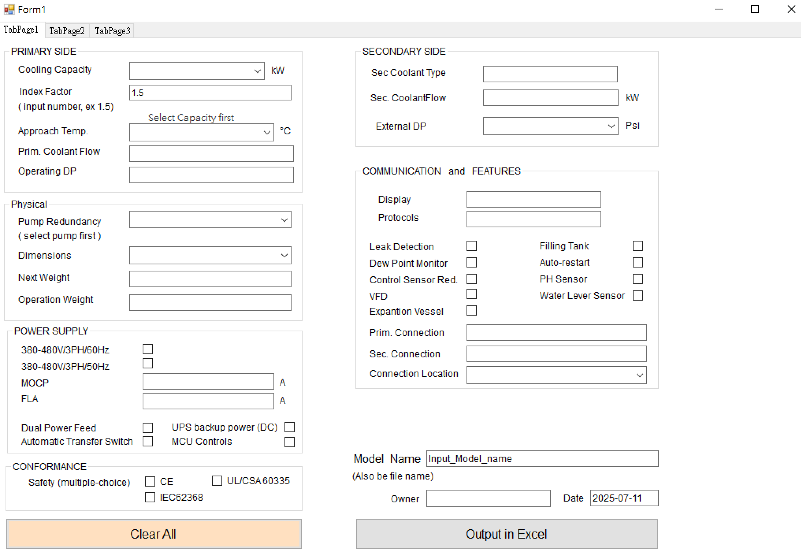
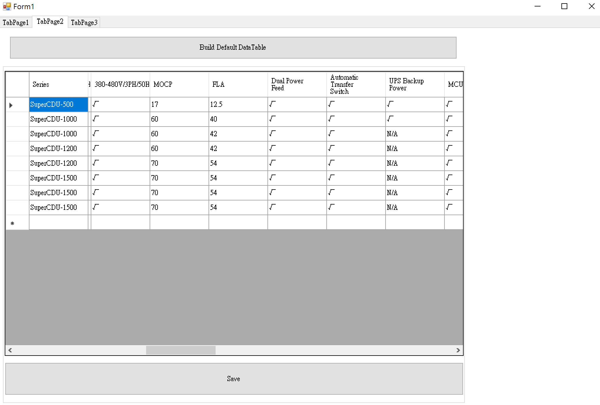
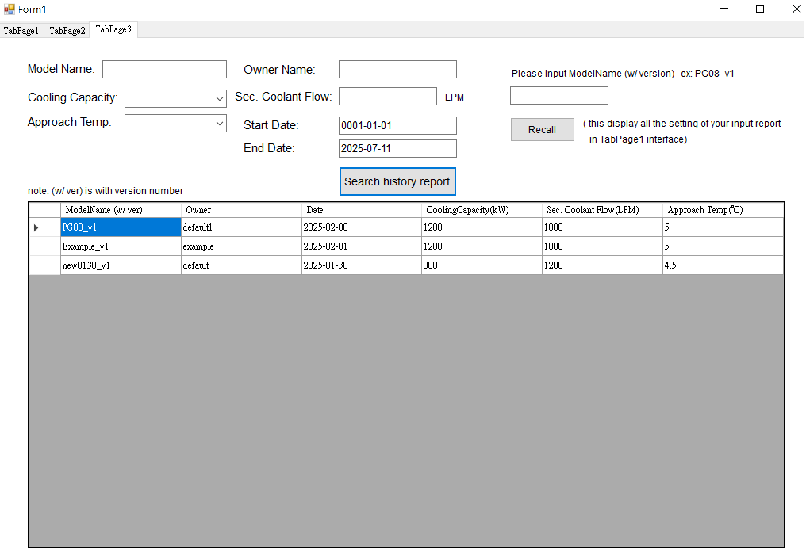

# ProductSpecManager
A Visual Basic Windows Forms application for managing and selecting product specifications via a user-friendly interface. Automatically generates formal Excel documents for client meetings and stores them in a time-based JSON folder.

---

App page 1

  

 
App page 2

  

 
App page 3

  

 
